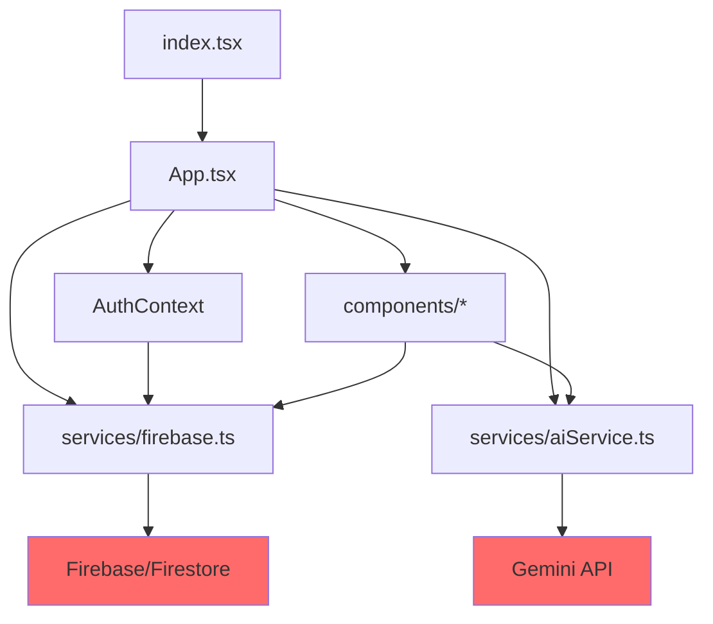

# VALID.AI Architecture Audit

**Date:** 2025-12-03  
**Version:** 2.0  
**Auditor:** AI Architecture Team

---

## Executive Summary

**Current State:** Prototype with functional features but architectural debt  
**Risk Level:** 🟡 **MEDIUM-HIGH** (Some critical issues, manageable with planned refactoring)

### Key Findings

- ✅ **Working:** All core features functional (auth, projects, interviews, AI analysis)
- ⚠️ **Monolithic Structure:** 2,236-line `App.tsx` with high coupling
- ⚠️ **Missing Observability:** No structured logging or error tracking
- ⚠️ **State Management Risks:** 40+ useState calls, no reconciliation layer
- ⚠️ **Single Points of Failure:** Firebase, Gemini API, Firestore subscriptions

---

## Component Architecture

### File Structure

```
VALID.AI-2.0-main/
├── App.tsx (2,236 lines, 35 functions) ← MONOLITHIC
├── components/ (6 files)
│   ├── AnalysisProgress.tsx
│   ├── InterviewModal.tsx
│   ├── Onboarding.tsx
│   ├── ProjectProfileModal.tsx
│   ├── QuestionAnalysis.tsx
│   └── SmartChat.tsx
├── services/ (2 files)
│   ├── aiService.ts (495 lines, 11 functions)
│   └── firebase.ts (92 lines, 9 functions)
├── context/
│   └── AuthContext.tsx
├── constants.ts
├── types.ts
└── index.tsx (entry point)
```

### Dependency Graph



**Legend:**  
🔴 Red = External dependency (SPOF)

---

## State Mutations Inventory

### Total useState Calls: **40+**

| File                                 | Count | Purpose                                |
| ------------------------------------ | ----- | -------------------------------------- |
| `App.tsx`                            | 25+   | Projects, interviews, UI state, modals |
| `components/SmartChat.tsx`           | 3     | Messages, input, loading               |
| `components/QuestionAnalysis.tsx`    | 1     | Selected keyword                       |
| `components/ProjectProfileModal.tsx` | 1     | Form data                              |
| `components/Onboarding.tsx`          | 1     | Current step                           |
| `components/InterviewModal.tsx`      | 2     | Retry state, update flag               |
| `components/AnalysisProgress.tsx`    | 1     | Message index                          |
| `context/AuthContext.tsx`            | 2     | User, loading                          |

### Critical State Mutations in App.tsx

1. **ProjectDetail Component (Line 292-681)**
   - `interviews` (useState + useRef + useEffect subscription)
   - `activeTab`
   - `selectedInterview`
   - `deletionInProgress` (useRef) ← RECENTLY ADDED FIX
2. **InterviewForm Component (Line 1370-1834)**
   - `step`, `answers`, `regData`, `currentVal`, `observation`, `isSaving`
3. **AppContent Component (Line 2063-2235)**
   - `projects`, `lang`, `theme`, `view`, `activeProject`, `showCreate`, `showOnboarding`, `showProfileModal`

### State Flow Issues

- **No centralized state management** (Redux, Zustand, etc.)
- **Props drilling** (passing through 3+ levels)
- **Race conditions** possible in Firestore subscription + local state updates

---

## External API Calls

### Firebase/Firestore (12 calls total)

| Function                | File          | Line  | Purpose                  | Risk                           |
| ----------------------- | ------------- | ----- | ------------------------ | ------------------------------ |
| `subscribeToProjects`   | `firebase.ts` | 28-40 | Real-time project list   | 🟡 SPOF                        |
| `createProject`         | `firebase.ts` | 42-49 | Create project           | 🟢 Low                         |
| `updateProject`         | `firebase.ts` | 51-55 | Update project           | 🟢 Low                         |
| `deleteProject`         | `firebase.ts` | 57-59 | Delete project           | 🟢 Low                         |
| `subscribeToInterviews` | `firebase.ts` | 61-73 | Real-time interview list | 🔴 SPOF (causes delete bug)    |
| `addInterview`          | `firebase.ts` | 75-78 | Save interview           | 🟢 Low                         |
| `deleteInterview`       | `firebase.ts` | 80-82 | Delete interview         | 🟡 Medium (idempotency needed) |
| `deleteInterviewsBatch` | `firebase.ts` | 84-91 | Batch delete             | 🟡 Medium (idempotency needed) |

**Identified Bug:** `subscribeToInterviews` restores deleted interviews due to:

1. Real-time subscription updates state immediately
2. Delete operation has latency
3. No lock mechanism to block updates during deletion

**Fix Implemented:** `deletionInProgress` useRef lock (App.tsx line 385)

### Gemini API (10 calls total)

| Function                 | File           | Line    | Purpose                      | Risk                               |
| ------------------------ | -------------- | ------- | ---------------------------- | ---------------------------------- |
| `discoverAvailableModel` | `aiService.ts` | 7-66    | Find usable model            | 🟢 Low (cached)                    |
| `callGeminiAPI`          | `aiService.ts` | 68-114  | Generic API wrapper          | 🔴 SPOF                            |
| `chatWithProjectContext` | `aiService.ts` | 160-192 | Smart chat                   | 🟡 Medium                          |
| `smartParseDocument`     | `aiService.ts` | 200-245 | Parse user input → questions | 🟡 Medium                          |
| `performDeepResearch`    | `aiService.ts` | 247-374 | Cross-interview analysis     | 🔴 HIGH (long-running, no timeout) |
| `analyzeAnswer`          | `aiService.ts` | 376-396 | Single answer validation     | 🟢 Low                             |
| `analyzeFullInterview`   | `aiService.ts` | 398-489 | Interview scoring            | 🔴 HIGH (no retry, no validation)  |

**Risks:**

- No retry logic on API failures
- No timeout enforcement
- No response validation
- API key exposed in environment variables (acceptable for now)

---

## Single Points of Failure (SPOF)

### 🔴 Critical SPOFs

1. **Firebase Connection**

   - **Impact:** App unusable if Firebase is down or blocked by browser
   - **Mitigation:** Implemented localStorage fallback (App.tsx line 564-590)
   - **Remaining Risk:** No sync mechanism when back online

2. **Gemini API**

   - **Impact:** No AI analysis possible if API fails
   - **Mitigation:** None
   - **Recommended:** Implement retry + fallback + caching

3. **Firestore Subscription**
   - **Impact:** Data appears/disappears unexpectedly
   - **Mitigation:** Partial (deletion lock implemented)
   - **Remaining Risk:** No conflict resolution for concurrent edits

### 🟡 Medium SPOFs

4. **Monolithic App.tsx**

   - **Impact:** Hard to test, maintain, debug
   - **Recommended:** Extract components and logic into separate files

5. **No Error Boundaries**
   - **Impact:** Single error crashes entire app
   - **Recommended:** Add React error boundaries with recovery strategies

---

## Error Handling Assessment

### Current State

- ❌ No global error boundary
- ❌ No structured logging
- ❌ No telemetry/analytics
- ✅ Try-catch blocks exist in some async operations
- ⚠️ Inconsistent error messaging to users

### Error Handling Locations

| Location          | Has Try-Catch | User Feedback | Recovery          |
| ----------------- | ------------- | ------------- | ----------------- |
| Firebase calls    | ✅ Some       | ✅ Alerts     | ❌ None           |
| Gemini API        | ✅ Some       | ⚠️ Partial    | ❌ None           |
| Delete operations | ✅ Yes        | ✅ Good       | ✅ Local fallback |
| Interview save    | ✅ Yes        | ✅ Good       | ✅ Local fallback |

---

## Performance Analysis

### Metrics

- **Bundle Size:** ~1.4 MB (large, but acceptable for SPA)
- **Initial Load:** Not measured (needs Performance API)
- **Render Performance:** No virtualization for long lists
- **Code Splitting:** Minimal (only 3 lazy-loaded components)

### Optimization Opportunities

1. **Lazy Load More Components:**
   - `QuestionAnalysis`, `DeepResearch`, `SmartChat` ← ALREADY DONE ✅
   - **NEW:** `IdeaStudio`, `DocumentParser`, `PromptDesigner`
2. **Virtualize Long Lists:**
   - Interview list (if >50 items)
   - Chat messages in SmartChat
3. **Memoization:**
   - DashboardView calculations
   - Chart render optimization

---

## Security Assessment

### Current State

- ✅ Firebase Authentication (Google OAuth)
- ✅ Firestore security rules enforce data isolation
- ✅ API keys in environment variables
- ⚠️ `.env` file not in `.gitignore` (FIXED)
- ⚠️ No rate limiting on AI API calls
- ⚠️ No input sanitization for text fields

### Firestore Rules (firestore.rules line 27-29)

```javascript
match /interviews/{interviewId} {
  allow read, write: if isAuthenticated();
}
```

**Issue:** Too permissive. Any authenticated user can read/write ANY interview.  
**Recommended:** Add `userId` to interviews and validate ownership.

---

## Recommended Refactoring Priorities

### 🔴 **Phase 1: Critical (Week 1-2)**

1. ✅ **Fixed:** Interview deletion bug
2. ⏳ **Create observability infrastructure** (logger.ts, telemetry.ts, errorBoundary.tsx)
3. ⏳ **Add AI retry logic** with validation and fallback
4. ⏳ **Improve Firestore security rules** (validate interview ownership)

### 🟡 **Phase 2: High Priority (Week 3-4)**

5. ⏳ **Extract App.tsx components** into separate files
6. ⏳ **Add state reconciliation** for offline/online sync
7. ⏳ **Implement request caching** to reduce AI API calls
8. ⏳ **Add unit tests** for critical paths

### 🟢 **Phase 3: Medium Priority (Week 5-6)**

9. ⏳ **Code splitting optimization**
10. ⏳ **Performance monitoring** (Web Vitals)
11. ⏳ **Virtualization** for long lists
12. ⏳ **Input sanitization**

---

## Conclusion

**Overall Architecture Grade:** C+ (Functional but needs refactoring)

**Strengths:**

- All features working
- Smart offline fallback strategy
- Recent bug fixes improving stability

**Weaknesses:**

- Monolithic structure
- Missing observability
- No validation/retry for AI calls
- Security rules too permissive

**Next Steps:**

1. Implement observability infrastructure (Phase 1.2)
2. Enhance AI prompting with retrylogic (Phase 2)
3. Begin architectural refactoring (Phase 2.5)
